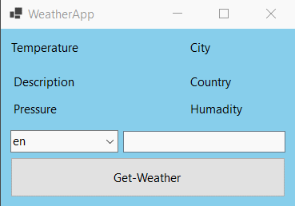

# Simple Weather App with OpenWeatherMap API



A basic Desktop Weather Application developed using Windows Forms, C#, and the OpenWeatherMap API. This application allows users to check the current weather conditions for a specific city, including temperature and description.

## Prerequisites

- [Visual Studio](https://visualstudio.microsoft.com/) or any other C# IDE
- OpenWeatherMap API Key - Get it [here](https://openweathermap.org/api)

## Getting Started

1. Clone the repository or download the ZIP file.

   ```bash
   git clone https://github.com/dotpep/weatherapp-winforms.git
   ```

2. Open the project in Visual Studio.

3. Replace the placeholder API key in `Form1.cs` with your actual OpenWeatherMap API key.

   ```csharp
   private const string ApiKey = "YOUR_OPENWEATHERMAP_API_KEY";
   ```

4. Install the required dependencies. Open the Package Manager Console in Visual Studio and run the following command:

```bash
Install-Package Newtonsoft.Json
```

This command installs the Newtonsoft.Json package, which is used for JSON handling in the project.
5. Build and run the application.

> Install Newtonsoft.Json:
>
> 1. Open your project in Visual Studio.
> 2. Right-click on your project in the Solution Explorer.
> 3. Choose "Manage NuGet Packages."
> 4. In the "Browse" tab, search for "Newtonsoft.Json."
> 5. Select it and click "Install."

## Usage

1. Enter the name of the city for which you want to check the weather in the provided text box.

2. Choose the language and units (metric, imperial, or standard) from the respective drop-down lists.

3. Click the "Get Weather" button to fetch and display the current weather information.

## To Do

Here are some potential improvements and new features that could be added to enhance the Weather App:

1. **Enhanced User Interface:**
   - Implement a more visually appealing and user-friendly interface.
   - Include icons or images that represent different weather conditions.

2. **Multiple City Forecast:**
   - Allow users to add multiple cities and switch between them to view the weather forecast.

3. **Historical Weather Data:**
   - Implement a feature to display historical weather data for a selected date.

4. **Auto-Refresh:**
   - Add an auto-refresh feature to periodically update the weather data without user input.

5. **Error Handling Enhancements:**
   - Improve error handling and provide more informative error messages to the user.

6. **Unit Testing:**
   - Implement unit tests to ensure the reliability and correctness of the application.

7. **Settings and Preferences:**
   - Allow users to customize units, language, and other preferences.

8. **Mobile Version:**
   - Consider creating a mobile version of the app for iOS and Android platforms.

9. **Geolocation Support:**
   - Add support for fetching weather data based on the user's current location.

10. **Localization:**
    - Implement localization support to allow users to choose the language for the application.

Feel free to pick any of these tasks or come up with your own ideas. Contributions and suggestions are welcome!


## Contributing

Contributions are welcome! If you have ideas for improvements or new features, feel free to open an issue or submit a pull request.

## License

This project is licensed under the [MIT License](LICENSE).
